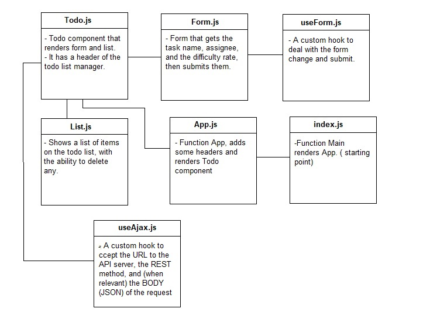

# TO DO List

A Web Application for securely managing a To Do List.

A web-based task manager application, written in React. designed for creating and organizing a “To Do” list in your browser.

### Prerequisites:

- `npm install`

To start the application :

- `npm start`

The browser should show you the following page:

### UML

